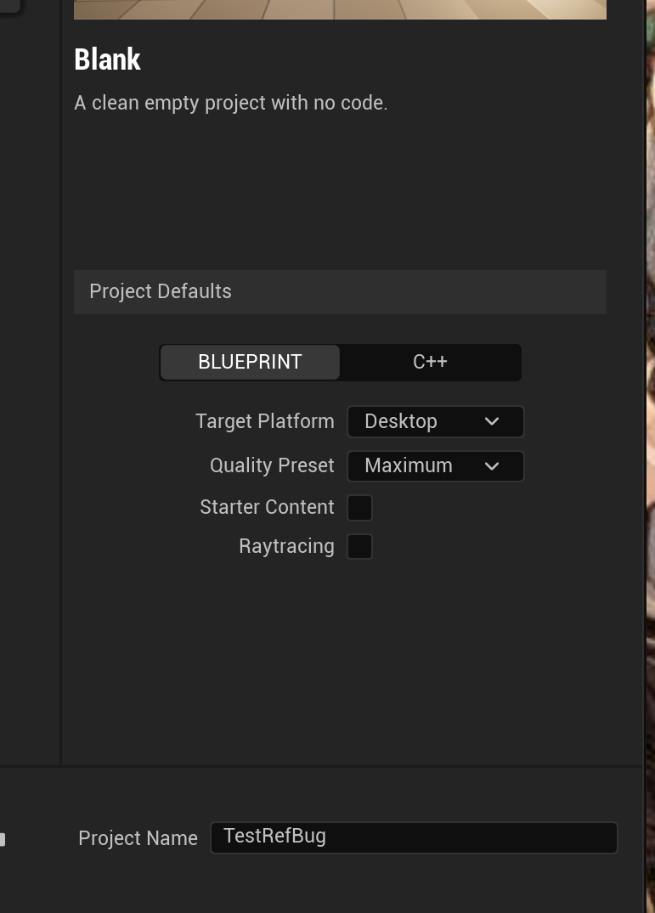
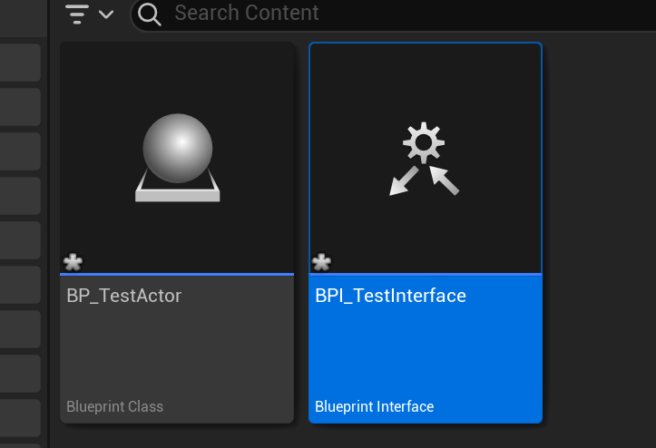
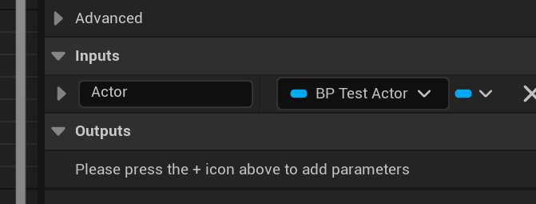
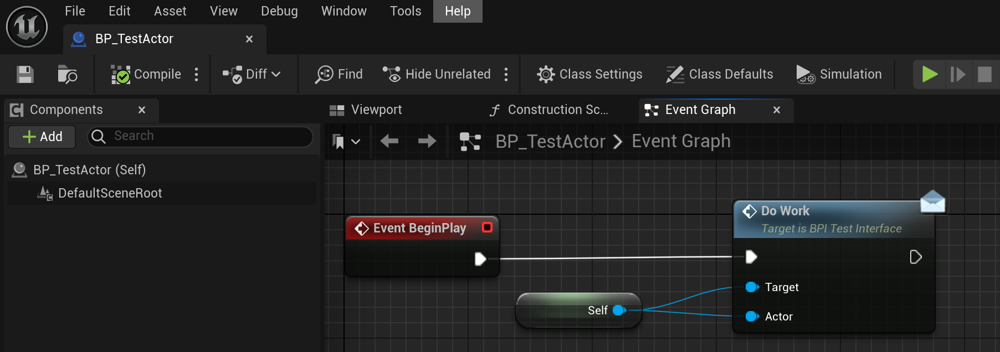
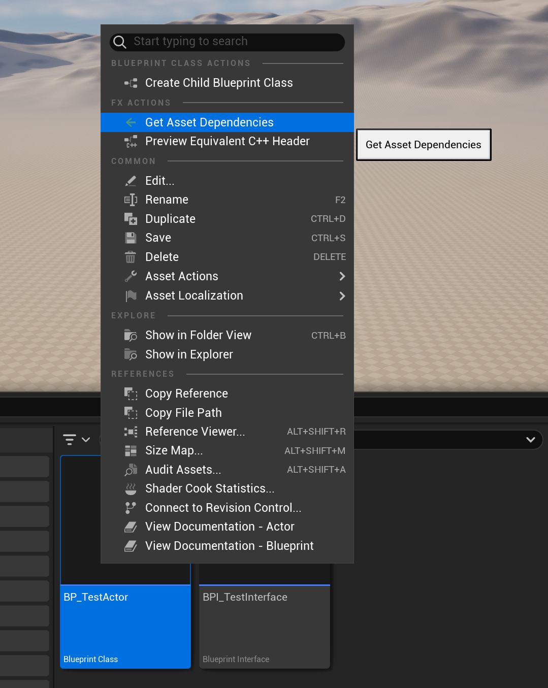
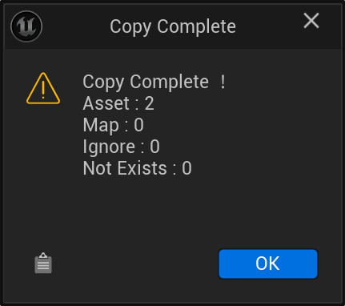
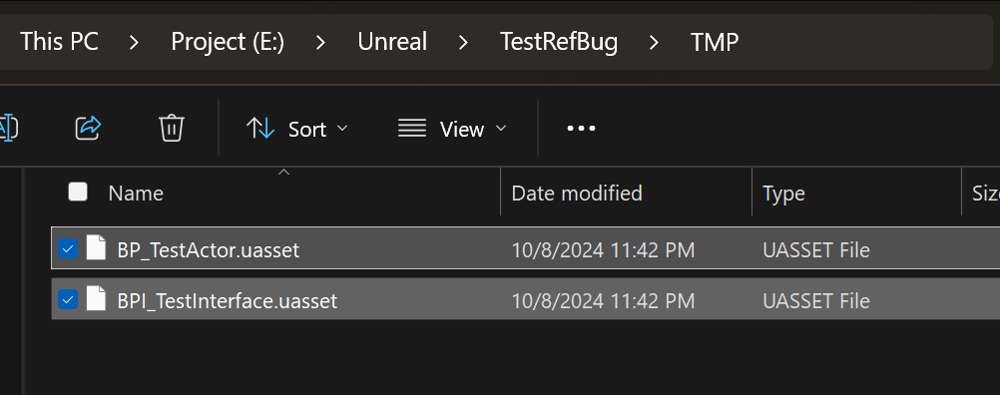
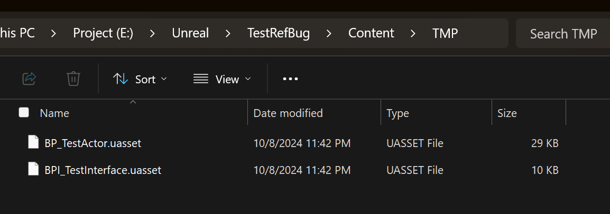
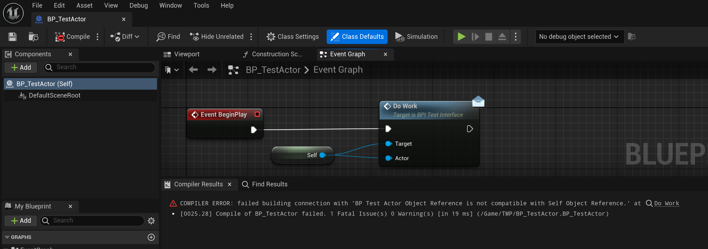

# Test CopyAssetRef bug

Step 1: an empty project

Step 2: Create `BP_TestActor` and `BPI_TestInterface`.

Step 3: Works as normal

Step 4: Perform Get Asset Dependencies

Step 5: Copy uasset files to `/Content`

Step 6: Get Compile Error

